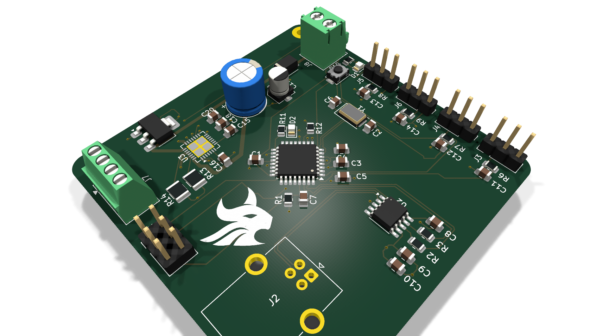
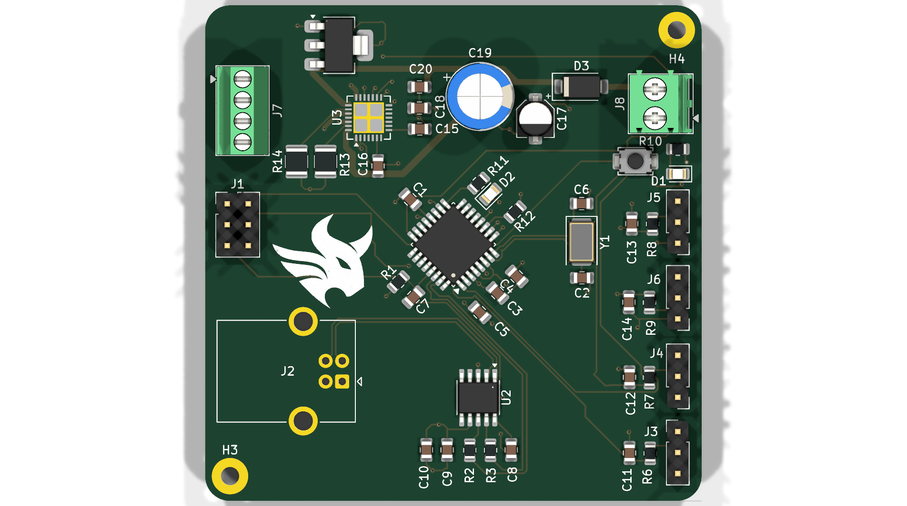
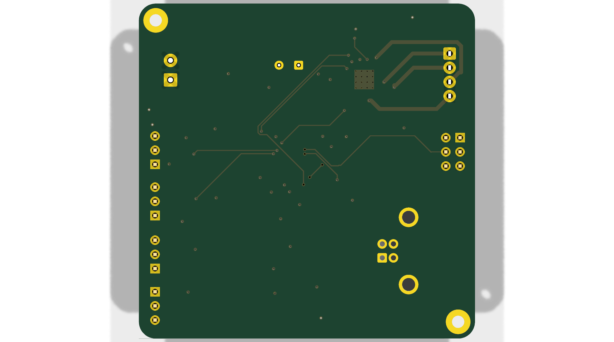

# ATmega-TMC2209 Stepper Motor Controller PCB

[](https://www.kicad.org/)
[](https://www.microchip.com/)
[](https://www.analog.com/tmc2209)
[](#)
[](LICENSE)
[](https://github.com/sbbxiii)

---

## 1. Executive Summary

The **ATmega-TMC2209 Motor Controller** is an open-source, Arduino-compatible motion control PCB designed in **KiCad 10.0.1**. It combines the familiar **Microchip ATmega328P** 8-bit AVR microcontroller with the high-performance **Trinamic TMC2209-LA** silent stepper motor driver on a compact $60.0\text{ mm} \times 60.0\text{ mm}$ two-layer FR-4 board.

Featuring an onboard **WCH CH340K** USB-to-UART converter with automated DTR reset, this board offers plug-and-play programming directly through the Arduino IDE, PlatformIO, or AVR-GCC. It provides silent stepper execution, sensorless homing via **StallGuard4™**, runtime current control over a single-wire **PD_UART** interface, and hardware RC-filtered sensor/endstop inputs.

---

## 2. 3D Raytraced Visualizations

````carousel

<!-- slide -->

<!-- slide -->

````

---

## 3. Circuit Architecture & Block Diagram

```mermaid
flowchart TD
    subgraph Power_Subsystem ["Power Distribution Network (PDN)"]
        VIN["Motor Power (4.75V - 29V)<br/>Terminal Block J8"] --> BulkCap["Bulk Decoupling<br/>100µF Radial + 2x 100nF"]
        BulkCap --> VMOT["VMOT Supply Rail"]
        VMOT --> LDO["NCP1117-5.0 LDO<br/>(Steps to +5V Logic)"]
        USB["USB Type-B Port (J2)"] --> Schottky["SS14 Schottky Diode (D3)"]
        Schottky --> VCC5["+5V System VCC Rail"]
        LDO --> VCC5
    end

    subgraph MCU_Subsystem ["Microcontroller & Communications"]
        VCC5 --> MCU["ATmega328P-A (TQFP-32)<br/>16.000 MHz Clock"]
        CH340["CH340K USB-UART (U2)"] <-->|UART RX/TX + DTR Reset| MCU
        ICSP["6-Pin AVR ISP Header (J1)"] <-->|SPI MOSI/MISO/SCK/RST| MCU
        MCU --> LEDS["Power & Diagnostic LEDs<br/>(D1, D2)"]
    end

    subgraph Motion_Subsystem ["Silent Motion Control"]
        VMOT --> TMC["Trinamic TMC2209-LA (U3)<br/>Silent Stepper Driver"]
        VCC5 --> TMC
        MCU -->|M1_STEP / M1_DIR / EN| TMC
        MCU <-->|PD_UART (Single-Wire)| TMC
        TMC --> SenseRes["Dual 0.11Ω 1210 Sense Resistors<br/>(R13, R14)"]
        TMC --> MotorOut["4-Phase Stepper Terminal (J7)<br/>(A1, A2, B1, B2)"]
    end

    subgraph IO_Subsystem ["Filtered Sensor Inputs"]
        Sensors["Endstops / Sensors (J3 - J6)"] --> RCFilt["RC Low-Pass Filters<br/>(1.5kΩ + 100nF)"]
        RCFilt --> MCU
    end
```

---

## 4. Hardware Specifications & Feature Matrix

### Electrical & Mechanical Metrics
| Specification | Parameter Value | Engineering Notes |
| :--- | :--- | :--- |
| **Board Footprint** | $60.00\text{ mm} \times 60.00\text{ mm}$ | Compact square profile with 3.0 mm radius rounded corners |
| **Mounting Pattern** | 4× M3 Mounting Holes | Positioned at corners for rigid enclosure mounting |
| **Layer Stackup** | 2-Layer FR-4 (1.6 mm thickness) | Top signal/routing + solid bottom GND pour |
| **Motor Input Voltage ($V_S$)** | **4.75V to 29.0V DC** | Accepts standard 12V or 24V industrial/3D-printer power supplies |
| **Motor Peak Current** | **2.8A Peak / 2.0A RMS** | Configurable in software via TMC2209 internal registers |
| **Current Sense Resistors** | Dual $0.11\ \Omega \pm 1\%$ (1210 SMT) | High power dissipation footprint for thermal stability |
| **Microstepping Modes** | Up to **1/256** | Native 1/16 with MicroPlyer™ interpolation to 1/256 |
| **Microcontroller** | ATmega328P-A (TQFP-32) | 32 KB Flash, 2 KB SRAM, 1 KB EEPROM @ 16 MHz |
| **USB Interface** | CH340K (SSOP-10) | Built-in clock, requires no external crystal |
| **Design Rule Check (DRC)** | **0 Errors, 0 Unconnected Items** | 100% compliant with standard 2-layer PCB fabrication rules |

---

## 5. Trinamic TMC2209 Key Features

1. **StealthChop2™**: Voltage-regulated chopper providing completely silent motor movement at low and medium velocities. Eliminates motor whine.
2. **SpreadCycle™**: Highly dynamic current control chopper mode that delivers high torque and precise microstepping at high step frequencies.
3. **StallGuard4™**: Real-time sensorless load measurement that detects mechanical endstops by monitoring motor back-EMF, eliminating mechanical limit switches.
4. **Single-Wire PD_UART**: Allows the ATmega328P to dynamically tune drive current, chopper thresholds, microstep resolution, and read motor diagnostics via one GPIO pin.

---

## 6. Pinout & Peripheral Mapping

### Microcontroller Pin Mapping
| ATmega328P Pin | Net Name | Hardware Function / Target Peripheral |
| :---: | :--- | :--- |
| **Pin 1 (PD3)** | `M1_STEP` | Step pulse command to TMC2209 Pin 16 |
| **Pin 2 (PD4)** | `M1_DIR` | Direction pulse command to TMC2209 Pin 17 |
| **Pin 9 (PB6)** | `XTAL1` | 16.000 MHz Crystal Oscillator ($Y1$) |
| **Pin 10 (PB7)** | `XTAL2` | 16.000 MHz Crystal Oscillator ($Y1$) |
| **Pin 11 (PD5)** | `EN` | Motor output enable/disable (active low) to TMC2209 Pin 18 |
| **Pin 12 (PD6)** | `PD_UART` | Half-duplex single-wire UART communication with TMC2209 Pin 20 |
| **Pin 13 (PD7)** | `DIAGNOSTIC` | StallGuard / fault flag input from TMC2209 Pin 22 |
| **Pin 15 (PB1)** | `DIGITAL_IN1` | Filtered digital input via header $J5$ (RC filtered) |
| **Pin 16 (PB2)** | `DIGITAL_IN2` | Filtered digital input via header $J6$ (RC filtered) |
| **Pin 17 (PB3)** | `MOSI` | SPI Master Out / In-System Programming ($J1$) |
| **Pin 18 (PB4)** | `MISO` | SPI Master In / In-System Programming ($J1$) |
| **Pin 19 (PB5)** | `SCK` | SPI Clock / In-System Programming ($J1$) |
| **Pin 23 (PC0)** | `ANALOG_IN3` | Filtered analog/digital input via header $J3$ |
| **Pin 24 (PC1)** | `ANALOG_IN4` | Filtered analog/digital input via header $J4$ |
| **Pin 29 (PC6)** | `RESET` | Active-low reset tied to tactile switch $SW1$ and CH340K DTR line |
| **Pin 30 (PD0)** | `RXD` (`UART-`) | Hardware UART receive from CH340K USB bridge |
| **Pin 31 (PD1)** | `TXD` (`UART+`) | Hardware UART transmit to CH340K USB bridge |

### External Connectors
| Connector | Type | Net Connections | Function |
| :--- | :--- | :--- | :--- |
| **J1** | 2×3 2.54mm Header | MOSI, MISO, SCK, RESET, VCC, GND | Standard AVR ICSP programming port |
| **J2** | USB Type-B Female | VBUS, D-, D+, GND | PC programming and USB serial communication |
| **J3** | 1×3 2.54mm Header | VCC, `ANALOG_IN3` (filtered), GND | Sensor / Potentiometer input |
| **J4** | 1×3 2.54mm Header | VCC, `ANALOG_IN4` (filtered), GND | Sensor / Limit switch input |
| **J5** | 1×3 2.54mm Header | VCC, `DIGITAL_IN1` (filtered), GND | Optical / Mechanical Endstop input |
| **J6** | 1×3 2.54mm Header | VCC, `DIGITAL_IN2` (filtered), GND | Optical / Mechanical Endstop input |
| **J7** | 4-Pin 2.54mm Screw Terminal | Motor Coils: `A1`, `A2`, `B1`, `B2` | Stepper motor phase output |
| **J8** | 2-Pin 3.5mm Screw Terminal | `VIN` ($4.75\text{V} - 29\text{V}$), `GND` | Main motor power supply input |

---

## 7. Deliverables & Production Assets

| Asset Category | File Path | Description |
| :--- | :--- | :--- |
| **Schematic Vector PDF** | [`schematic/ATmega_TMC2209_Schematic.pdf`](schematic/ATmega_TMC2209_Schematic.pdf) | High-resolution printable schematic |
| **Schematic Vector SVG** | [`schematic/ATmega_TMC2209_Schematic.svg`](schematic/ATmega_TMC2209_Schematic.svg) | Scalable vector graphic of complete circuit |
| **Bill of Materials** | [`manufacturing/ATmega_TMC2209_BOM.csv`](manufacturing/ATmega_TMC2209_BOM.csv) | Full component list with footprints and quantities |
| **Fabrication Package** | [`manufacturing/ATmega_TMC2209_Gerbers_Rev1.zip`](manufacturing/ATmega_TMC2209_Gerbers_Rev1.zip) | Production gerbers & Excellon drill file |
| **KiCad 10 Project** | [`hardware/`](hardware/) | Native `.kicad_pro`, `.kicad_sch`, and `.kicad_pcb` CAD files |

---

## 8. Author & License

* **Designed & Engineered by:** Osakwe Nmesoma Chukwukadibia ([@sbbxiii](https://github.com/sbbxiii))
* **License:** [MIT License](LICENSE)
